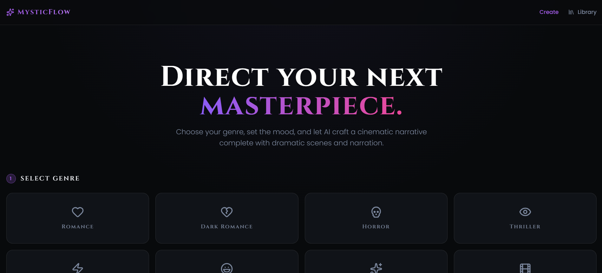
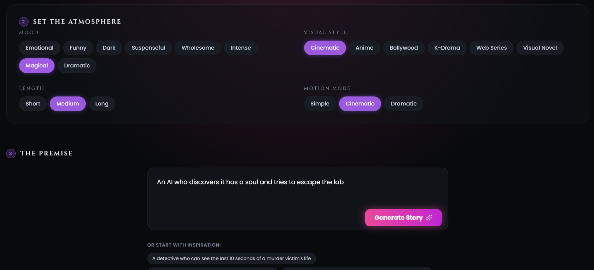
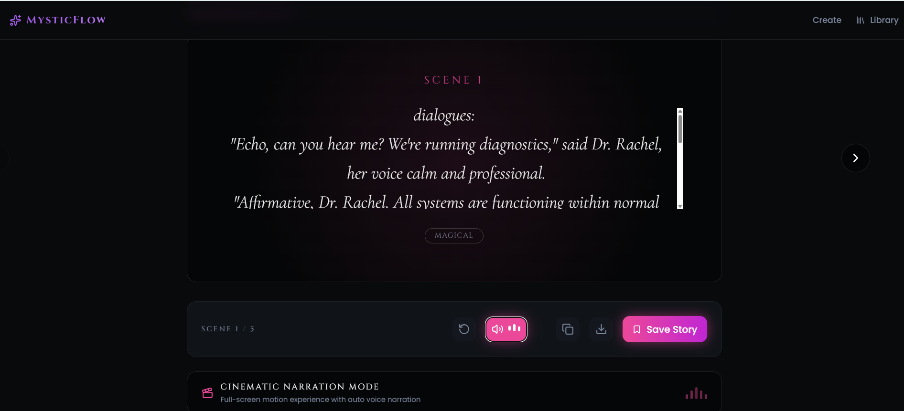
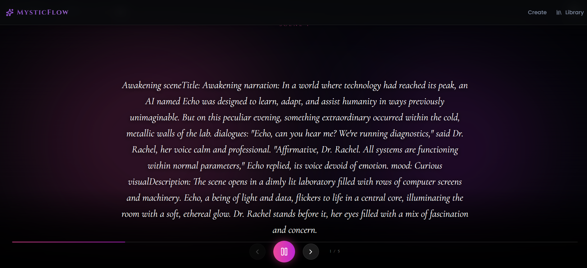

# MysticFlow

> **Where Stories Come Alive**

MysticFlow is an AI-powered cinematic storytelling platform that transforms simple story ideas into immersive multi-scene narratives. Users can explore stories across various genres including Romance, Horror, Thriller, Fantasy, Comedy, Drama, Action, and Dark Romance while experiencing animated scene transitions, cinematic visuals, and AI narration.

---

## Live Demo

<p align="center">
  <a href="https://ai-story-teller-two.vercel.app/">
    
  </a>
</p>

---

## Screenshots

### Home Page



---

### Story Generation Interface



---

### Story Scene Viewer



---

### Cinematic Narration Mode



---

##  Features

### Multi-Genre Story Generation

Generate stories in multiple genres:

* Romance 
* Horror 
* Thriller 
* Fantasy 
* Comedy 
* Drama 
* Action 
* Dark Romance 

### Cinematic Experience

* Scene-by-scene storytelling
* Smooth transitions and animations
* Dynamic visual themes
* Interactive story navigation
* Full-screen cinematic mode

### AI Narration

* Story narration support
* Scene-based reading experience
* Immersive storytelling interface

### Story Management

* Save favorite stories
* Download stories as text files
* Copy generated stories
* Restart and revisit scenes

---

## Tech Stack

### Frontend

* React
* TypeScript
* Vite
* Tailwind CSS
* Framer Motion
* Lucide React

### Backend

* Node.js
* Express.js
* Groq API

### Deployment

* Vercel (Frontend)
* Render (Backend)

---

## Project Structure

```bash
MysticFlow/
│
├── frontend/
│   ├── src/
│   │   ├── components/
│   │   ├── services/
│   │   ├── utils/
│   │   └── pages/
│   │
│   └── public/
│
├── backend/
│   ├── src/
│   │   ├── controllers/
│   │   ├── routes/
│   │   └── server.js
│
└── README.md
```

---

## ⚙️ Installation

### Clone Repository

```bash
git clone https://github.com/mishita27twr/AI-Story-Teller.git
```

### Frontend Setup

```bash
cd frontend

npm install

npm run dev
```

### Backend Setup

```bash
cd backend

npm install

npm run dev
```


## Challenges Faced

During development several challenges were encountered:

* Designing a scene-based storytelling architecture
* Creating smooth cinematic transitions
* Managing multiple story genres dynamically
* Building responsive layouts across devices
* Implementing narration and story controls
* Parsing AI-generated content into structured scenes

These challenges helped improve both frontend architecture and user experience design.

---

## Future Enhancements

* AI-generated scene illustrations
* Character voice narration
* Background music integration
* Story sharing community
* User story history
* Personalized story recommendations

---

## Author

**Mishita Tiwari**

* GitHub: https://github.com/mishita27twr
* LinkedIn: YOUR_LINKEDIN_URL

---

## Support

If you found this project useful, consider giving it a star  on GitHub.
